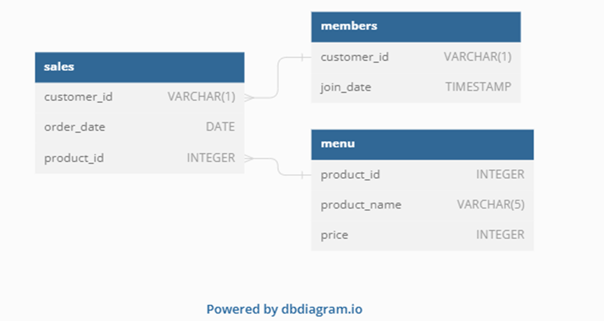

# 8 Week SQL Challenge

This is the free 8 week SQL challenge created by Danny Ma from Data with Danny. This repositories consists all of the answer for the challenge. If you are interesting to join the challenge check out [Danny's website.](https://8weeksqlchallenge.com)

##  Table of Contents

* [Case Study #1: Danny's Diner](https://github.com/amanda-nascimentobarbosa/8_week_sql_challenge/blob/main/README.md#-case-study-1---dannys-diner)
* Case Study #2: Pizza Runner
* Case Study #3: Foodie-Fi
* Case Study #4: Data Bank
* Case Study #5: Data Mart
* Case Study #6: Clique Bait
* Case Study #8: Fresh Segments
 
## Case Study #1 - Danny's Diner

  

 
  
<h3>Case Study 1 - Danny's Diner - Details</h3>

<h3>Business Case</h3>
  
Danny wants to use the data to answer a few simple questions about his customers, especially about their **visiting patterns**, **how much money they’ve spent** and also **which menu items are their favourite**. Having this deeper connection with his customers will help him deliver a better and more personalised experience for his loyal customers.

He plans on using these insights **to help him decide whether he should expand the existing customer loyalty program** - additionally he needs help to generate some basic datasets so his team can easily inspect the data without needing to use SQL.

Danny has provided you with a sample of his overall customer data due to privacy issues - but he hopes that these examples are enough for you to write fully functioning SQL queries to help him answer his questions!

Danny has shared with you 3 key datasets for this case study:

* sales
* menu
* members

You can inspect the entity relationship diagram and example data below.

<h3>Case Study Questions</h3>
  
1. What is the total amount each customer spent at the restaurant?
2. How many days has each customer visited the restaurant?
3. What was the first item from the menu purchased by each customer?
4. What is the most purchased item on the menu and how many times was it purchased by all customers?
5. Which item was the most popular for each customer?
6. Which item was purchased first by the customer after they became a member?
7. Which item was purchased just before the customer became a member?
8. What is the total items and amount spent for each member before they became a member?
9. If each $1 spent equates to 10 points and sushi has a 2x points multiplier - how many points would each customer have?
10. In the first week after a customer joins the program (including their join date) they earn 2x points on all items, not just sushi - how many points do customer A and B have at the end of January?

**Bonus Questions**

1. Join All The Things - The following questions are related creating basic data tables that Danny and his team can use to quickly derive insights without needing to join the underlying tables using SQL. Create the table with the columns: customer_id, order_date,	product_name, price and	member

2. Rank All The Things - Danny also requires further information about the ranking of customer products, but he purposely does not need the ranking for non-member purchases so he expects null ranking values for the records when customers are not yet part of the loyalty program.

<h3>Solution</h3>

Tool used: Microsoft SQL Server

Functions:

* CTE, common table expression
* Window Functions
* Aggregate functions — SUM, COUNT
* Join - LEFT JOIN
* GROUP BY Statement
* CASE Expression
* CREATE Database and table 

You can view the solution [here](/week_1/)

<h3>Insights</h3>

After the analysis we can observe some insights:

- About visiting patterns
  * Customer B was the one who attended the establishment the most so far, making 6 visits;
  * Followed by client A with four visits and client C with only two visits;
  * Customers A and C typically order more than one item during a single visit; this may be a sign that they will be dining with company.
  
- How much money they’ve spent
  * Customers A and B, who are already members, spent the most amount at the restaurant in January 2021, an average of 75.00;
  * Customer C, who attended only 2 times, in that same month spent only 36.00;
  * According to the points table, customer B has 940 points, followed by customer A with 860 points, and customer C with 360 points;
  * If we consider that in the first week as a member the items purchased are worth twice the score, customer A has 1370 and B 820.
  
- Which menu items are their favourite
  * Ramen is the most consumed item on the menu, so far;
  * Curry and sushi are dishes that clients have just before joining the club and may be the deciding factor in that decision. Given that customer C, a single-ramen consumer, has not yet joined.
  
 - The restaurant should expand the membership
   * After joining the membership club, customers started coming to the restaurant more often, indicating that the club has the potential to grow and encourage customer loyalty.
  

